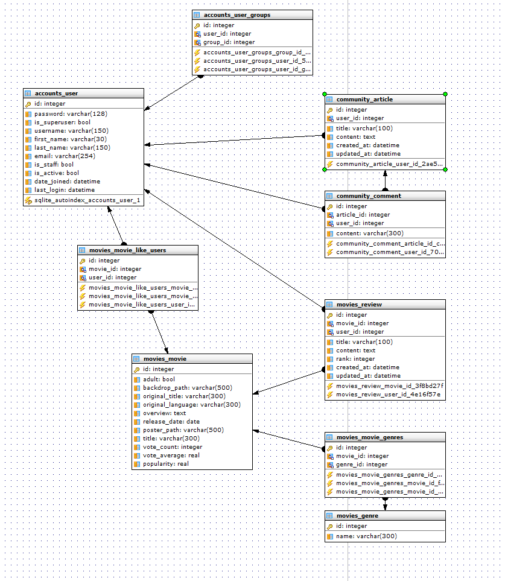

# Final Project

> TMDB API를 활용해 사용자에게 영화정보를 제공.
>
> 사용자는 간단한 영화 리뷰와 평점을 남길 수 있고, 자유게시판을 사용하여 DB에 없는 영화를 신청 할 수 있음.
>
> 간단한 추천 알고리즘을 통해 사용자에게 영화를 추천
>
> 관리자는 유저 정보를 삭제 및 권한 수정이 가능하고 필요한 영화와 배우를 검색해 DB저장이 가능

#### 1. 팀원 및 업무 분담

- 구동엽 / 정용우
- 시작만 영화 / 게시글 부분으로 업무를 분담
- 그 후, 전체적으로 필요한 부분이 생기면 같은 기능도 분담하여 진행
- 전체적인 분담 내용은 lab.ssafy에서 확인 가능

#### 2. 목표 서비스 구현 및 실제 구현 정도

- 매일 업데이트되는 영화를 메인 화면에 띄워 유저에게 제공

  - TMDB의 top_rate 정보를 활용하여 20개중 상위 5개만 제공
  - 새로고침시 API요청을 계속 보내는 것을 막고자 session 활용(쿠키에는 정보를 다 저장하기 어렵기 때문) - 더 좋은 방법 찾는 중

- 많은 사람이 사용하는 넷플릭스와 왓챠를 참고하여 영화 목록을 슬라이드 하여 확인 가능하고 전체 목록은 무한 스크롤이 가능함

  - vue-infinite-loader와 vue-swiper를 활용
  - 혼용을 불가능하다고 판단하여 적은 정보를 가져올 때는 swiper를 사용, 많은 정보는 infinite loader 활용

- Django Admin 페이지를 활용하면 유저 관리, 게시글 관리, DB관리가 가능하지만 좀 더 나은 UI를 제공하기 위해 관리자 페이지 따로 제작

  - 영화 제목 / 출연 배우로 영화 검색을 가능하게 하여 원하는 영화를 DB 저장

    - 복수 선택하여 DB에 저장하려 했지만 시간 부족으로 인해 한번에 하나씩 가능

    - 이런 이유로 사용자가 찾는 영화가 DB에 없을 때 요청 게시글을 작성하면 관리자가 확인 후 등록

  - 유저 정보를 선택 후 스태프 권한을 줄 수 있고, 유저를 삭제할 수 있음

    - 스태프 권한은 게시글 삭제, 수정과 리뷰 삭제, 수정 가능

  - 게시글 목록을 통해 바로 삭제 가능

- 영화 세부 정보 페이지에서 YOUTUBE 트레일러 영상 확인 가능

#### 3. 데이터베이스 모델링(ERD)

#### 4. 필수기능

1. 관리자 뷰
   - 영화 DB 관리, 유저 권한 관리, 유저 삭제, 게시글 삭제
2. 영화 정보
   - 평점, 장르, 줄거리, 트레일러
3. 추천 알고리즘
   - 
4. 커뮤니티
   - 페이지 이동 가능, 스태프권한 삭제 수정 가능

#### . 배포 서버 URL

dongyeop.tk

#### . 기타(느낀점)

안쓰는 노트북을 서버로 배포하기 위해 노력